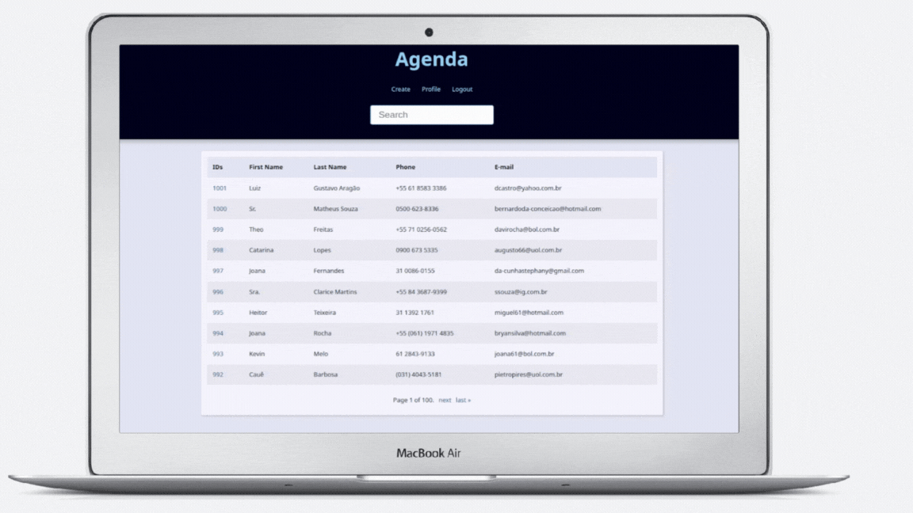

<h1 align="center">
    <strong> Project Agenda Django</strong>
</h1>

<p align="center">
    <apan align="center">
      
    </apan>
</p>


## 🧪 Tecnologias

Esse projeto foi desenvolvido com as seguintes tecnologias:

- [HTML](https://developer.mozilla.org/pt-BR/docs/Web/HTML)
- [CSS](https://developer.mozilla.org/pt-BR/docs/Web/CSS)
- [Django](https://docs.djangoproject.com/en/4.2/)

## 🚀 Como executar

Clone o projeto e acesse a pasta do mesmo.

```bash
$ git clone https://github.com/erikbernard/project_agenda_django.git
$ cd project_agenda_django
```

Para iniciá-lo, siga os passos abaixo:

```bash
pip install -r requirements.txt

python manage.py makemigrations

python manage.py migrate

python manage.py runserver
```


## 💻 Projeto

O presente projeto foi concebido com o propósito de colocar em prática os conhecimentos básicos adquiridos até o momento em relação ao framework Django. Por meio desse projeto de estudo de caso.

